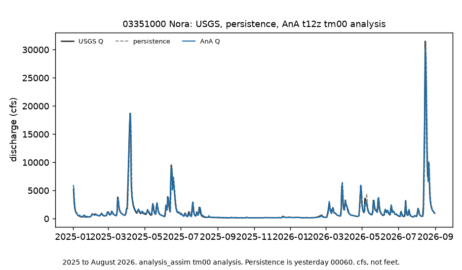
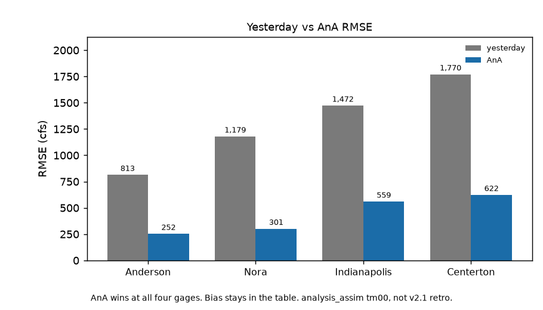

# White River NWM AnA 2025 to 2026

Does operational NWM analysis-assim beat yesterday's flow on the White River in 2025 to August 2026?

Yes. On 2025-01-01 to 2026-08-31, operational AnA beat yesterday at all four gages. Science `4fdedca`. Nora 301 vs 1,179. Anderson 252 vs 813. Indianapolis 559 vs 1,472. Centerton 622 vs 1,770. Bias is small (-6, +7, -17, +67 cfs). Fetch-or-stop covered 608 AnA noon-UTC files.

Frozen v2.1 science stays `fa2e315`. That table is WY2019 to 2020 retrospective, Anderson-only win. This table is operational AnA `t12z` `tm00` on a later window. Same four gages. Persistence is still the bar.

Gages, upstream to downstream: **03348000 Anderson**, **03351000 Nora**, **03353000 Indianapolis**, **03354000 Centerton**. Residual is AnA minus USGS, in cfs.

Parent: https://github.com/martialsystems/white_river_nwm_error (`fa2e315`). Do not restamp it.



Figure 1. Live window at Nora: USGS Q, persistence, operational AnA. Persistence RMSE 1,179 cfs; AnA 301 cfs.



Figure 2. AnA minus USGS, not water. Anderson to Centerton. Bias stays near zero except Centerton +67 cfs.

## Live skill (2025-01-01 to 2026-08-31)

608 AnA days fetched. Comparable days after lag-1 and USGS gaps: 604 / 603 / 604 / 607.

| Gage | Persistence RMSE | AnA RMSE | Bias (AnA minus USGS) |
|------|-----------------:|---------:|----------------------:|
| Anderson 03348000 | 813 | 252 | -6 |
| Nora 03351000 | 1,179 | 301 | +7 |
| Indianapolis 03353000 | 1,472 | 559 | -17 |
| Centerton 03354000 | 1,770 | 622 | +67 |

AnA wins all four on RMSE and MAE. Noon UTC `tm00` versus daily mean 00060. cfs, not feet.

## Stage 0

Synthetic 2025 window so CI runs without S3.

```bash
python3.12 -m venv .venv
source .venv/bin/activate
pip install -r requirements.txt
PYTHONPATH=src:. python3 scripts/run_fixture.py logs/stage0_fixture
.venv/bin/python -m pytest tests -q
PYTHONPATH=src:. python3 scripts/run_live.py logs/live
```

Do not use stock `/usr/bin/python3 -m pytest`. Live `run_live.py` exits 2 on a missing AnA day. Two figures max.

| File | Role |
|------|------|
| [METHODOLOGY.md](METHODOLOGY.md) | Locked contract |
| [AGENTS.md](AGENTS.md) | Agent rules |
| [CHECKLIST.md](CHECKLIST.md) | Operator list |
| `src/nwmana/` | NWIS, AnA t12z tm00, skill, figures |

Write-up: https://gist.github.com/martialsystems/1104e5e47b8a04006ec694d289d43639

Research index: https://gist.github.com/martialsystems/66b896b0a4a0b8cba2b478aef64312f3
